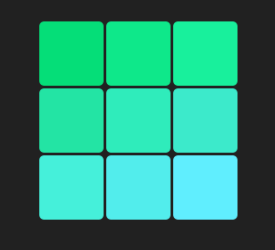

# ReactJS Projects 🚀

This repository contains a collection of front-end projects developed using **HTML**, **CSS**, **JavaScript**, and **ReactJS**. Each project demonstrates practical features, user interface components, and logic using modern web development tools.

---

## 🛠️ Tech Stack

- HTML5
- CSS3
- JavaScript (ES6+)
- ReactJS
- React Hooks (`useState`)

---

## 🔢 Projects Included
### 1. Sign Up Form 📄

A sleek and responsive Sign-Up form built with **ReactJS**. This project demonstrates the use of controlled components, form validation, and user-friendly UX design.

> **Features:**
- Input fields for name, email, and password
- Password visibility toggle
- Validation with inline error messages
- Responsive layout using modern CSS

📂 Folder: `Sign Up Form`

SignUp Form 


Login Form


---

### 2. Tic Tac Toe 🎮

An interactive **Tic Tac Toe** game built using **ReactJS**, allowing two users to enter their names and play alternately.

> **How it works:**
1. Players enter their names.
2. Click **Start Game** to begin.
3. The game board appears with X and O turns.
4. The app announces the winner or a draw.
5. Players can:
   - Reset the current match (keep names)
   - Reset the entire game (new players)

> **Key Concepts:**
- React hooks (`useState`)
- Conditional rendering
- Props and component reuse
- Simple game logic handling wins, draws, and turns

📂 Folder: `TicTacToe`

 <!-- Replace with a better image if needed -->

---

Stay tuned for more exciting ReactJS projects! 🌱

***

### For React Projects

```bash
cd "Sign Up Form"
npm install
npm start
