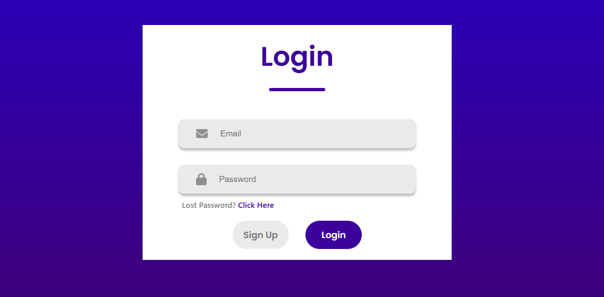

# React Sign-Up / Login Form 📝 

A responsive and user-friendly Sign-Up/Login interface built using **ReactJS**. This project uses state toggling to dynamically switch between forms and conditionally display input fields based on the current mode.

---

## 🛠️ Tech Stack

- HTML5  
- CSS3  
- JavaScript (ES6+)  
- ReactJS  
- React Hooks (`useState`)  

---

## ✨ Features

- 🔁 Dynamic form switching between **Login** and **Sign Up** modes using React state
- 👤 Displays the Name input only in Sign Up mode
- 📧 Icon-enhanced inputs for Name, Email, and Password
- 🔐 Minimal and clean styling with custom CSS
- ❓ "Lost Password?" prompt shown in Login mode only

---

## 📸 Screenshots

### ✅ Sign Up View

### 🔐 Login View

---

## 📂 Project Structure

