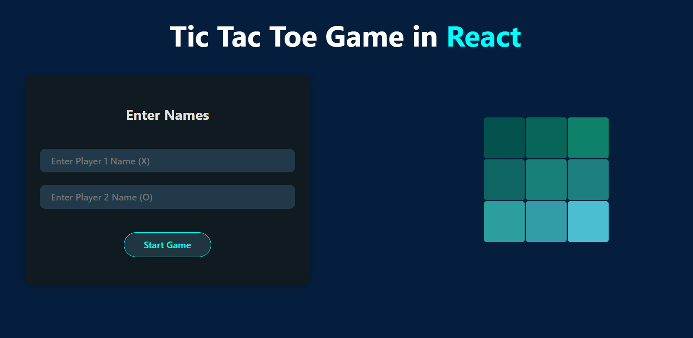
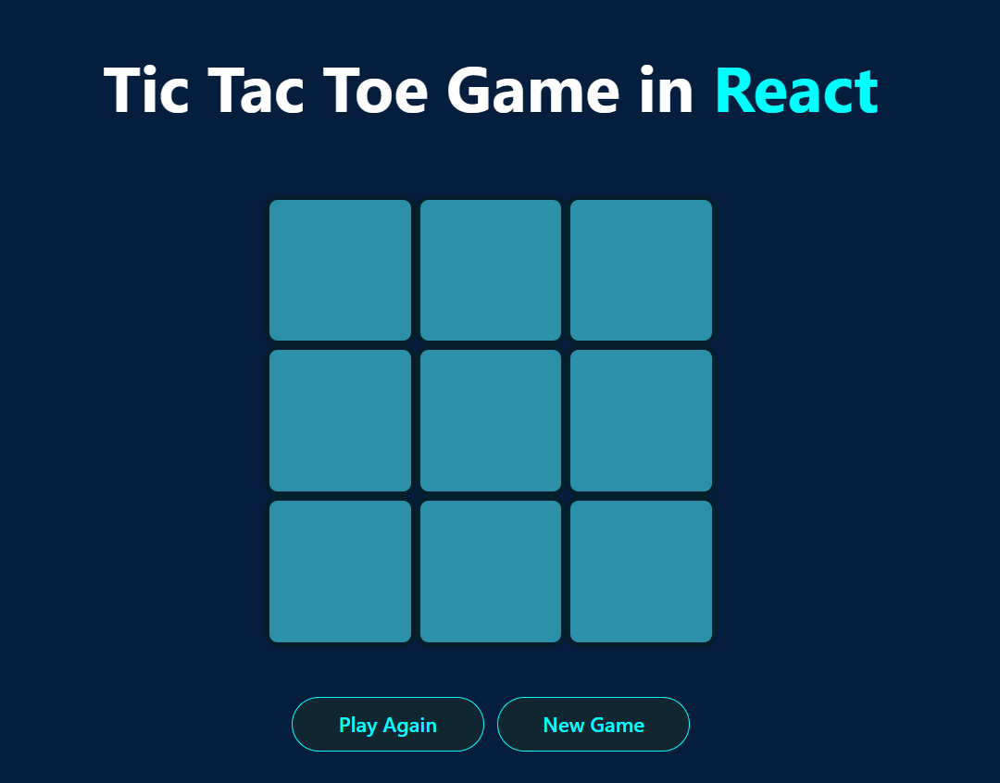
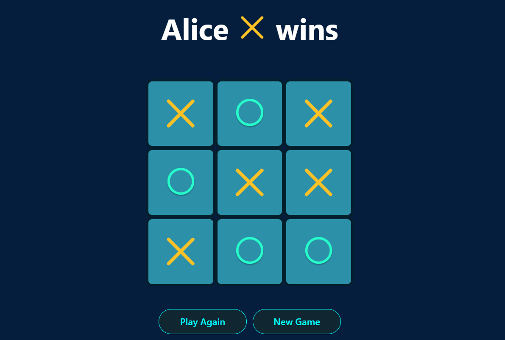
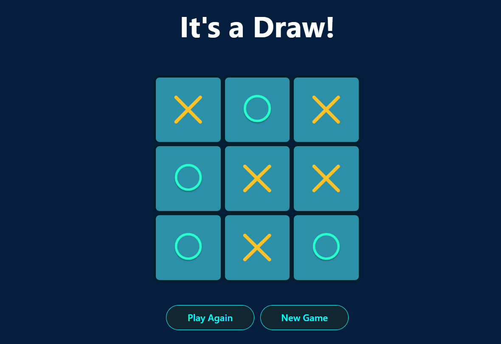

# Tic Tac Toe - ReactJS Project 🎮

This is a classic Tic Tac Toe game built with **ReactJS**, designed for two players to compete on the same device. The app allows players to enter their names, play the game with real-time updates, and provides options to reset the game or start fresh with new players.

---

## Features

- **Player Names Input:**  
  Before the game starts, both players can enter their names to personalize the experience.

- **Interactive Game Board:**  
  A 3x3 grid where players take turns placing their marks (X or O).

- **Game Logic:**  
  - Detects when a player wins by forming a horizontal, vertical, or diagonal line.  
  - Declares a draw if all squares are filled without a winner.  
  - Highlights the winning combination.

- **Reset Options:**  
  - **Reset Match:** Clears the board but keeps player names for a new round.  
  - **Reset Game:** Clears everything including player names, allowing new players to join.

- **User Experience:**  
  Smooth UI with immediate feedback on player turns and game status.

---

## How to Use

1. **Enter player names** in the input fields.
2. Click the **Start Game** button.
3. Take turns clicking on empty squares to place X or O.
4. Watch the game announce the winner or a draw.
5. Use **Reset Match** to play again with the same players.  
6. Use **Reset Game** to start over and enter new player names.

---


---

## Technologies Used

- **ReactJS** (with hooks like `useState`)
- CSS for styling and layout
- Vite for project bundling and dev server

---

## Screenshots

## Players Entry 
  

## Game Board
  

## Player Wins


## It's Draw !



---

## How to Run Locally

1. Clone the repository or download the Tic Tac Toe folder.
2. Navigate into the project directory:
   ```bash
   cd TicTacToe

3. Install dependencies:
   ```bash
   npm install
   
4. Start the development server:
   ```bash
   npm run dev

***

# Open http://localhost:5173 in your browser to play the game.
